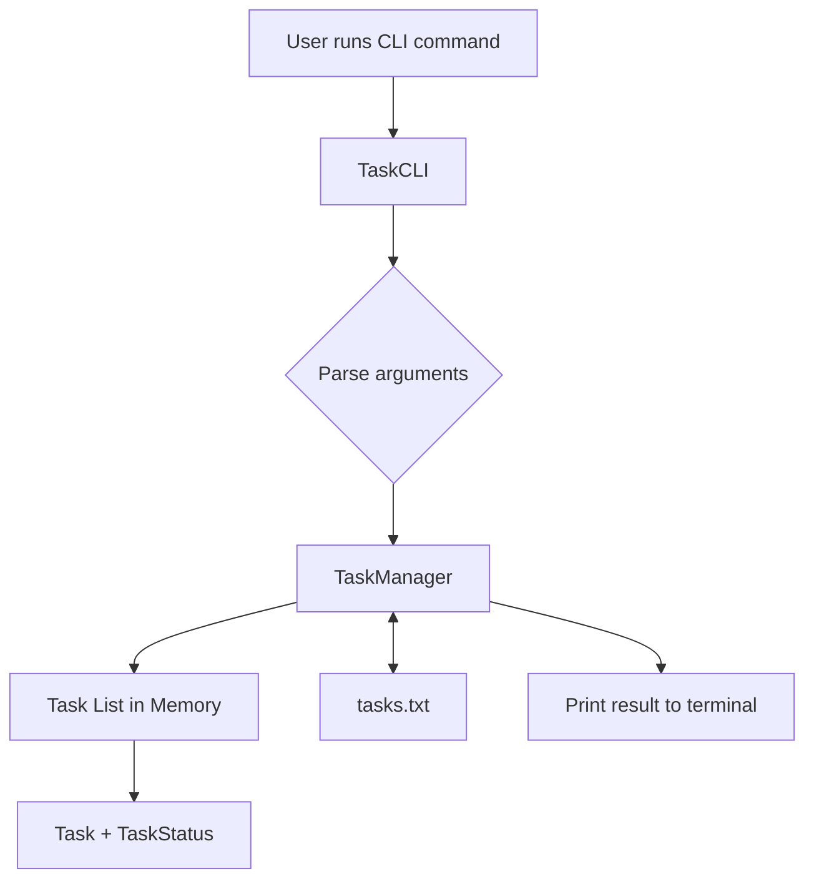

# Java CLI Task Manager

 **Demo Video (Unlisted):**  
https://youtu.be/CCZLopkmbzM

A command-line utility built in Java to manage tasks efficiently while preparing for DSA and internship work.

## Problem Statement

While preparing for Data Structures & Algorithms (DSA), internships, and daily development work, I needed a quick and distraction-free way to manage tasks without relying on GUI applications or external tools.

Existing solutions were either too heavy or required switching contexts.
This project solves that problem by providing a lightweight, generic CLI-based task manager that works entirely from the terminal and can be used for DSA preparation, internship tasks, or daily development work.

## Features

- Add a new task from the command line
- List all tasks with their current status
- Mark a task as completed
- Delete a task by ID
- Persistent storage using a local file (tasks are retained across runs)
- Clear error handling for invalid commands or inputs

## Architecture



## How to Run the Program

### Prerequisites

- Java JDK 8 or higher
- Command-line access (Terminal / PowerShell / VS Code terminal)

### Compile the Program

```bash
javac *.java
```

### Run the CLI

**Add a task:**
```bash
java TaskCLI add "Complete internship assignment"
```

**List tasks:**
```bash
java TaskCLI list
```

**Mark a task as completed:**
```bash
java TaskCLI complete 1
```

**Delete a task:**
```bash
java TaskCLI delete 1
```

## Design Decisions

**CLI-based approach:**
A command-line interface was chosen to keep the tool lightweight, fast, and distraction-free, suitable for developers who spend most of their time in the terminal.

**Java as the implementation language:**
Java provides strong type safety, clear object-oriented design, and robust standard libraries without relying on external frameworks.

**Data structure choice:**
Tasks are stored using a List as the expected number of tasks is small, and operations like listing, searching, and updating can be efficiently handled with linear traversal. This keeps the implementation simple and readable.

**Persistent file storage:**
Tasks are stored in a local file to ensure persistence across program runs without introducing database complexity.

**Separation of concerns:**
- `Task` represents the task model
- `TaskManager` handles business logic and storage
- `TaskCLI` manages command parsing and user interaction

This structure improves maintainability and clarity.

**Enum-based status:**
Task status is modeled using a Java enum instead of strings to enforce type safety and prevent invalid states.

## Sample Output

```
> java TaskCLI add "Prepare demo video"
Task added successfully.

> java TaskCLI list
1. Prepare demo video [PENDING]

> java TaskCLI complete 1
Task marked as completed.

> java TaskCLI delete 1
Task deleted successfully.
```

## Demo Video

A short demo video (3–5 minutes) demonstrates:

- The problem being solved
- Compiling and running the CLI tool
- Adding, listing, completing, and deleting tasks
- Explanation of design choices

**Demo Video (Unlisted):**  
https://youtu.be/CCZLopkmbzM

## Author

**Jagadeeswar**  
Java & Full Stack Developer  
Internship Assignment Submission
